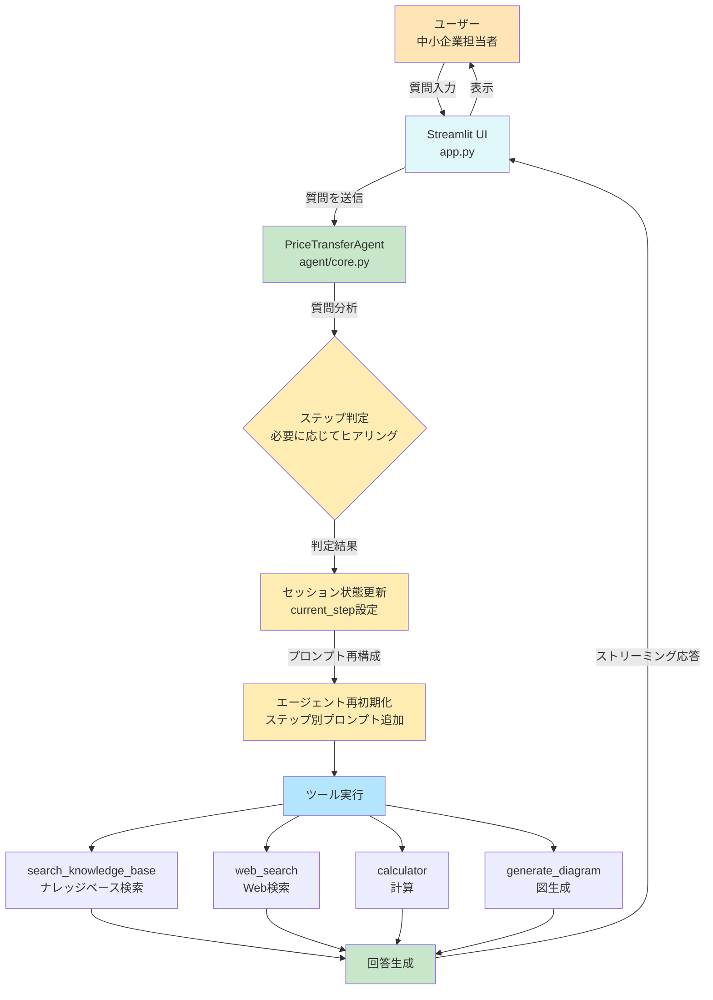
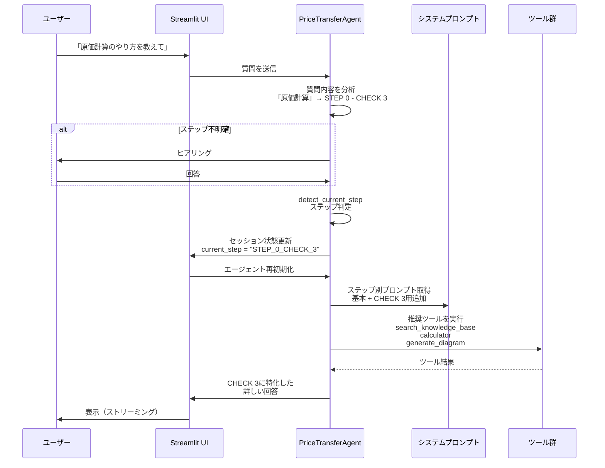
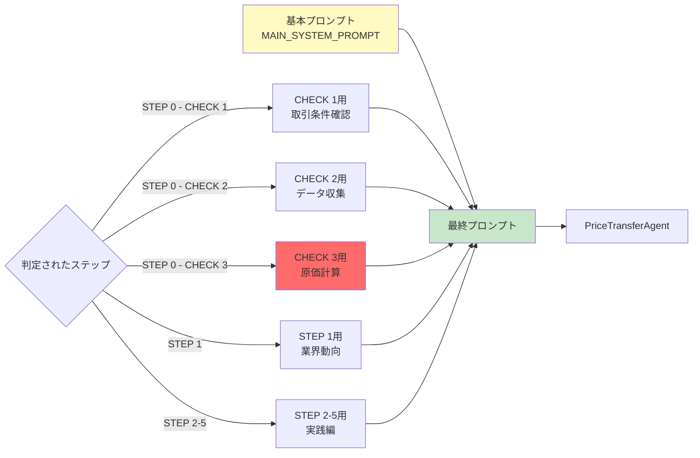
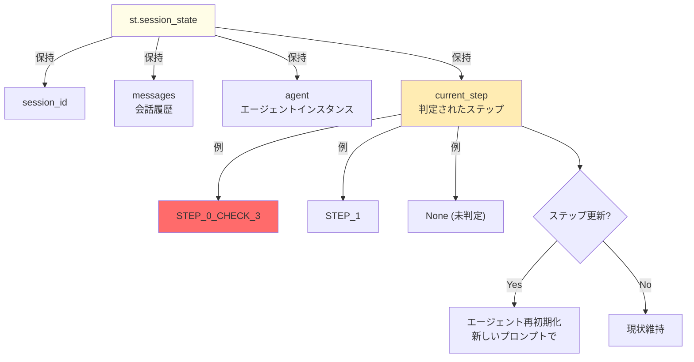
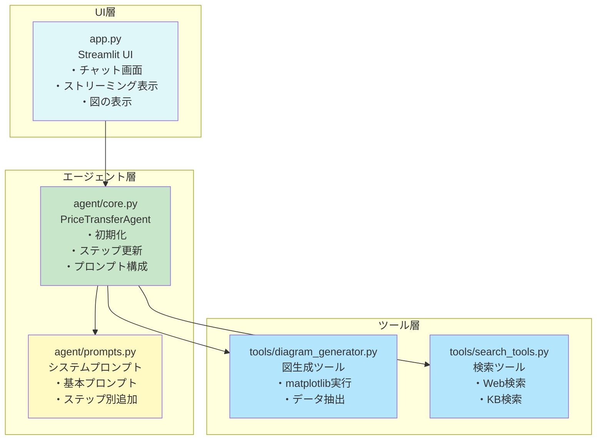
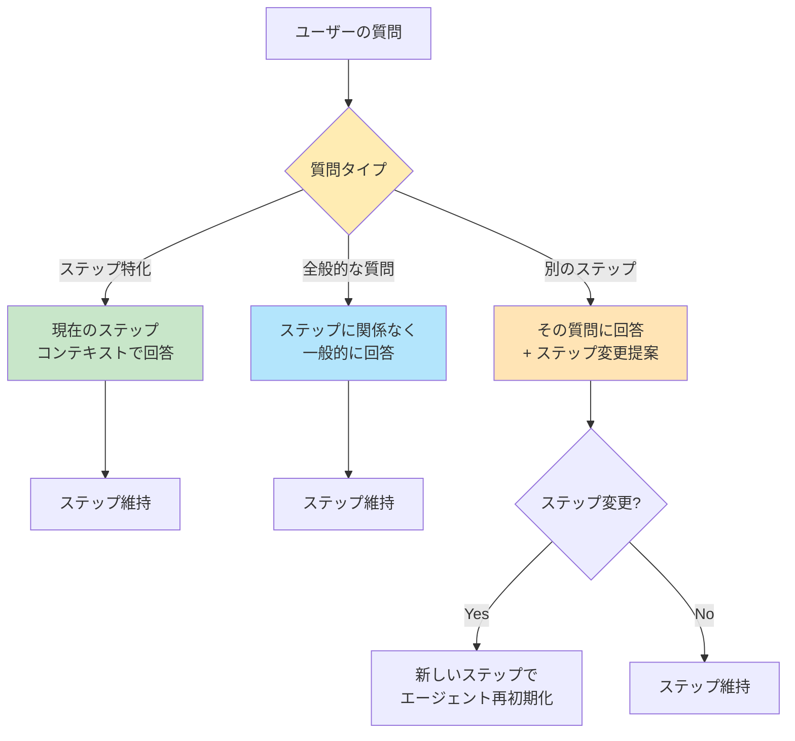

# システムアーキテクチャ図

## 全体フロー

## ステップ判定と動的プロンプト切り替え

## プロンプト構成

## データフロー

## ファイル構成と責務

## ステップ判定の柔軟性

---

## 重要なポイント

### 1. ステップ判定は「推奨」であって「制約」ではない
- ステップが判定されても、全般的な質問や他のステップの質問にも柔軟に対応
- ステップは「フォーカス」を設定するだけ

### 2. プロンプトの動的切り替え
- 基本プロンプト + ステップ別追加プロンプトで構成
- ステップ判定後、エージェントを再初期化して最適化

### 3. ツールの推奨使用
- 各ステップに応じて推奨ツールを自動的に使用
- 例: CHECK 3 では `search_knowledge_base` + `calculator` + `generate_diagram`

### 4. セッション状態の活用
- `current_step` でステップを管理
- 会話中にステップが変わっても対応可能
