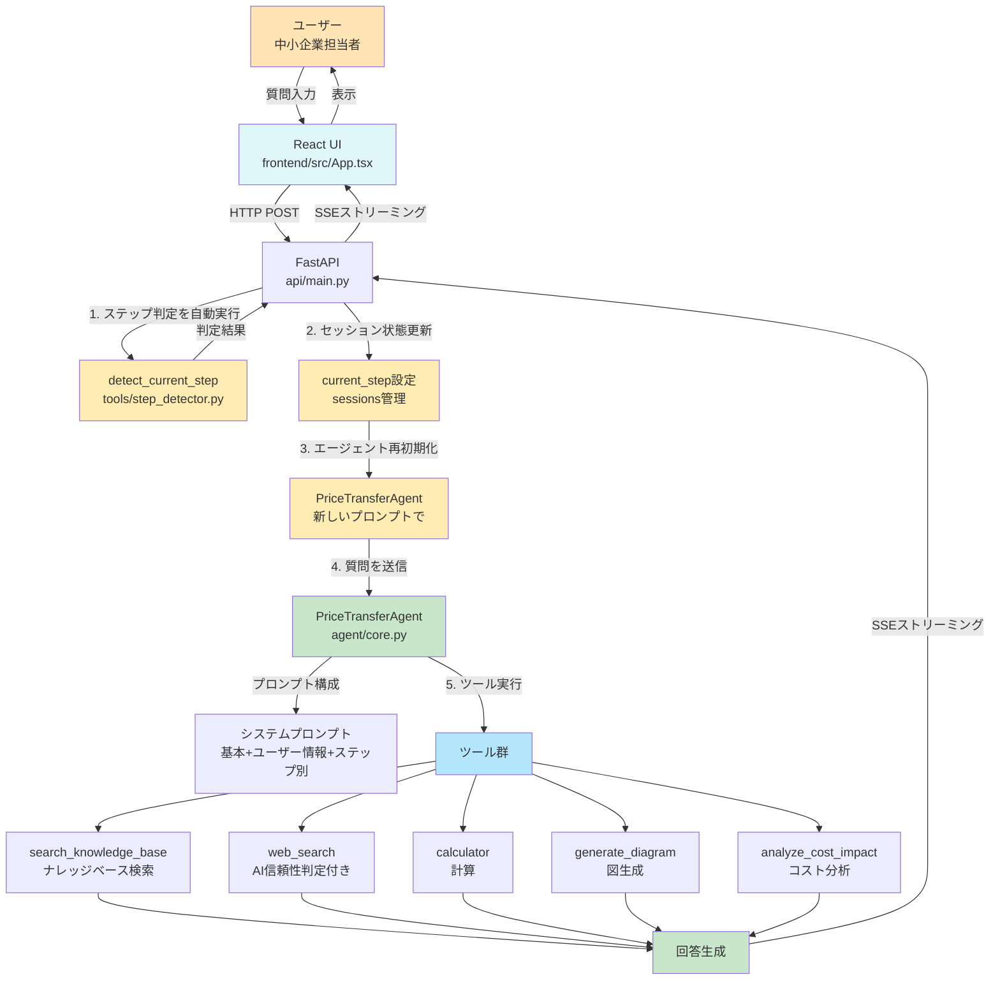
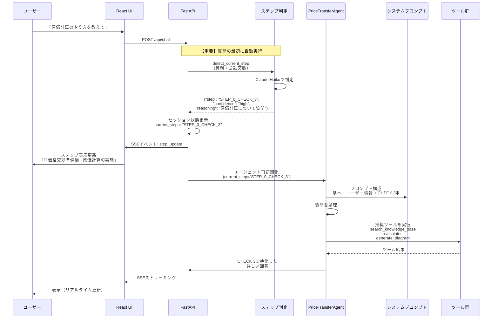
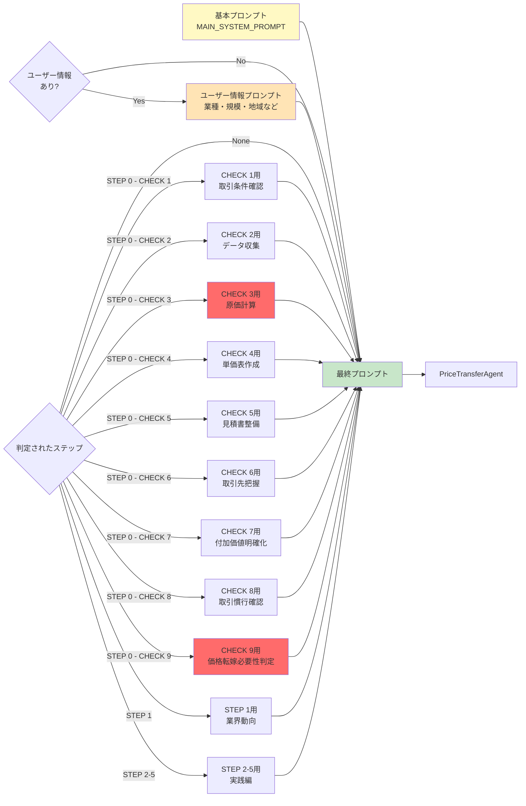
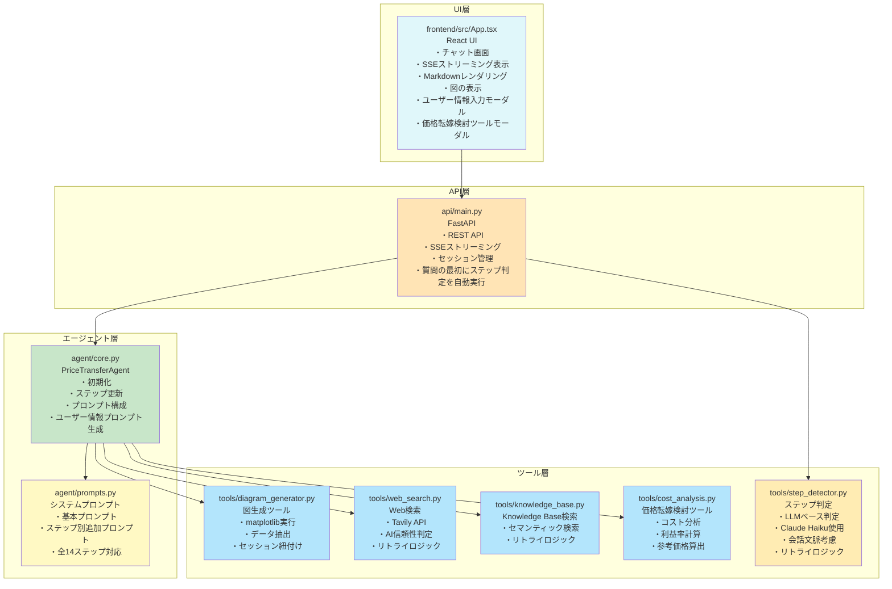
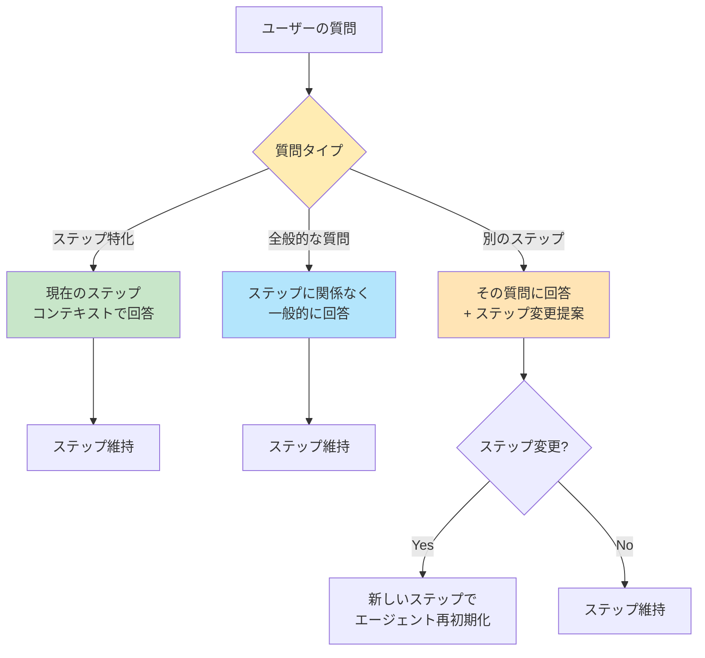
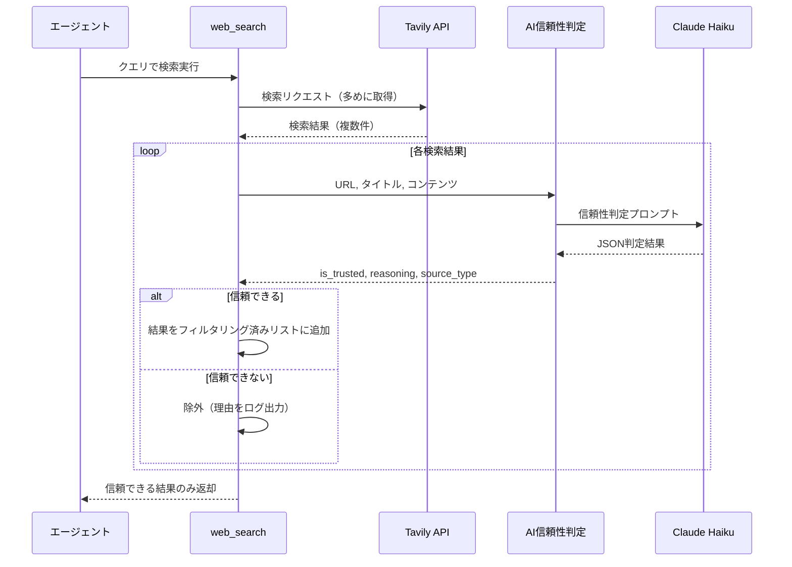
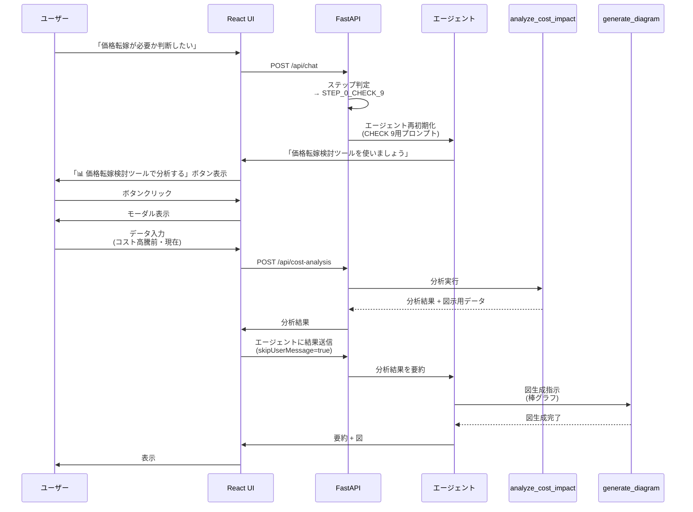

# システムアーキテクチャ図

## 全体フロー



## ステップ判定と動的プロンプト切り替え（最新フロー）



## プロンプト構成（3つのプロンプトを動的に結合）



## データフロー

```mermaid
graph TD
    Session[FastAPI Sessions<br/>api/main.py] -->|保持| SID[session_id]
    Session -->|保持| MSG[messages<br/>会話履歴]
    Session -->|保持| AGT[agent<br/>エージェントインスタンス]
    Session -->|保持| STEP[current_step<br/>判定されたステップ]
    Session -->|保持| USER[user_info<br/>ユーザー企業情報]
    Session -->|保持| TIME[created_at<br/>セッション作成時刻]

    React[React State] -->|取得| API[GET /api/session/{id}/messages]
    React -->|更新| API2[POST /api/chat]

    STEP -->|例| E1["STEP_0_CHECK_3"]
    STEP -->|例| E2["STEP_0_CHECK_9"]
    STEP -->|例| E3["None (未判定)"]

    STEP --> Update{ステップ更新?}
    Update -->|Yes| Reinit[エージェント再初期化<br/>新しいプロンプトで]
    Update -->|No| Keep[現状維持]

    USER -->|例| U1["industry: 製造業<br/>products: 金属加工部品"]
    USER --> Personalize[パーソナライズされた<br/>アドバイス]

    style Session fill:#FFFDE7
    style STEP fill:#FFECB3
    style USER fill:#E1BEE7
    style E1 fill:#FF6B6B
    style E2 fill:#FF6B6B
```

## ファイル構成と責務



## ステップ判定の柔軟性



---

## 重要なポイント

### 1. ステップ判定は質問の最初に自動実行（重要な変更点）

- **旧仕様**: エージェントが手動で `detect_current_step` ツールを呼び出す
- **新仕様**: バックエンドで質問の最初に自動実行（[api/main.py:221-289](api/main.py#L221-L289)）
- **メリット**:
  - エージェントがツールを呼び出す必要がない
  - ステップ判定が確実に実行される
  - 判定結果に基づいてエージェントが最適なプロンプトで初期化される

### 2. プロンプトの動的切り替え（3つのプロンプトを結合）

- **基本プロンプト** + **ユーザー情報プロンプト** + **ステップ別追加プロンプト**
- ユーザー情報がある場合は、業種や規模に応じた具体的なアドバイスを提供
- ステップ判定後、エージェントを再初期化して最適化

### 3. ツールの推奨使用

- 各ステップに応じて推奨ツールを自動的に使用
- 例: CHECK 3 では `search_knowledge_base` + `calculator` + `generate_diagram`
- 例: CHECK 9 では `analyze_cost_impact`（価格転嫁検討ツール）を積極的に推奨

### 4. セッション状態の活用

- `current_step` でステップを管理（バックエンドで管理）
- `user_info` でユーザー企業情報を管理
- `created_at` でセッション作成時刻を記録（図のフィルタリングに使用）
- 会話中にステップが変わっても対応可能
- フロントエンドでステップ表示を更新

### 5. アーキテクチャの分離

- **フロントエンド**: React + TypeScript（UI層）
- **バックエンド**: FastAPI（API層、セッション管理）
- **エージェント**: Strands Agents（ビジネスロジック層）
- **ツール**: 各種ツール実装（機能層）

### 6. ストリーミング実装

- Server-Sent Events (SSE) を使用
- リアルタイムでテキストチャンク、ステータス、ツール使用状況、ステップ更新を送信
- ユーザー体験の向上

---

## ツール詳細

### `web_search` (tools/web_search.py)
**目的**: Web検索を実行し、AI判定により信頼できる情報源のみを表示

**機能**:
- Tavily APIを使用したWeb検索
- **AI信頼性判定機能**: Claude Haikuが各検索結果のURL、タイトル、コンテンツを評価
- 信頼できる公的機関（政府機関、自治体、支援機関、企業サイト、メディアなど）のソースのみフィルタリング
- ソース種別を自動分類（政府機関/公的機関/学術機関/業界メディア/ニュースメディア/データ提供サイト/業界団体/企業サイト）
- 最大5件の検索結果を取得
- **リトライロジック**: レート制限エラー時に指数バックオフで最大5回リトライ

**AI信頼性判定の仕組み**:
1. Tavily APIで検索結果を取得（多めに取得）
2. 各結果に対して`is_trusted_source_ai()`を実行
3. Claude Haikuが以下を判定:
   - 信頼性の可否（is_trusted）
   - 判定理由（reasoning）
   - ソース種別（source_type）
4. 信頼できると判定された結果のみを返却

**判定基準**:
- ✅ **信頼できる**: 政府機関(.go.jp)、地方自治体(.lg.jp)、公的支援機関、大学・研究機関(.ac.jp)、信頼できる業界団体、企業サイト、メディア、データ提供サイト
- ❌ **信頼できない**: 個人ブログ、アフィリエイトサイト、まとめサイト、広告目的サイト

### `search_knowledge_base` (tools/knowledge_base.py)
**目的**: AWS Bedrock Knowledge Baseから価格転嫁関連情報を検索

**機能**:
- ナレッジベースID: `7SM8UQNQFL` (ap-northeast-1)
- セマンティック検索（ベクトル検索）
- 最大5件の結果を取得
- 出典ファイル名とスコアを表示
- S3ロケーションから元ファイルを特定
- **リトライロジック**: レート制限エラー時に指数バックオフで最大5回リトライ

**使用場面**:
- Knowledge Baseを最優先で使用
- 公式ガイドラインや価格転嫁事例を検索
- 具体的な手順やチェックリストの取得

### `detect_current_step` (tools/step_detector.py)
**目的**: ユーザーの質問から価格転嫁プロセスのステップを自動判定

**機能**:
- Claude Haikuを使用したLLMベース判定
- STEP 0 (CHECK 1〜9) および STEP 1〜5 に対応
- 判定理由と信頼度（high/medium/low）を返却
- 詳細なデバッグログ機能
- 会話の文脈を考慮した判定
- **リトライロジック**: レート制限エラー時に指数バックオフで最大5回リトライ

**判定フロー**:
1. ユーザーの質問内容と会話文脈を分析
2. 価格転嫁プロセスの各ステップ定義と照合
3. 最も関連性の高いステップを判定
4. JSON形式で結果を返却: `{"step": "STEP_0_CHECK_3", "confidence": "high", "reasoning": "..."}`

**重要**: バックエンドで質問の最初に自動実行（エージェントが手動で呼び出す必要なし）

### `analyze_cost_impact` (tools/cost_analysis.py)
**目的**: コスト高騰の影響を分析し、価格転嫁の必要性を判定

**使用場面**: STEP 0 - CHECK 9（価格転嫁の必要性判定）

**機能**:
- コスト高騰前と現在のデータを比較
- 利益率の変化を計算
- 各コスト項目の増減率・増減額を計算
- コスト高騰前の利益率を維持するための参考価格を算出
- 価格転嫁の必要性を判定
- **自動図生成**: 分析結果に基づいて棒グラフを自動生成（図示用データを含む）

**フロントエンド連携**:
- STEP 9判定時、「📊 価格転嫁検討ツールで分析する」ボタンを表示
- モーダルでデータ入力 → 分析実行 → 結果をエージェントに送信 → 要約 + 図生成

### `generate_diagram` (tools/diagram_generator.py)
**目的**: データを可視化する図を自動生成

**機能**:
- 4種類の図に対応: 棒グラフ、折れ線グラフ、フローチャート、ネットワーク図
- description からデータを自動抽出（JSON形式、テーブル形式、リスト形式）
- 生成された図は `diagrams/` フォルダに保存
- セッションに紐づく図のみ表示（セッション作成時刻以降の図）
- UI上で最新の図を自動表示（アシスタントメッセージの直後）
- 日本語フォント対応（Windows/macOS/Linux）

**使用場面**:
- 原価構造の可視化（STEP 0 - CHECK 3）
- 価格推移のグラフ化
- プロセスフローの図示
- コスト分析結果の可視化（STEP 0 - CHECK 9）

---

## データフロー: Web検索（AI信頼性判定付き）



---

## データフロー: 価格転嫁検討ツール（CHECK 9専用）



---

## React版への移行

### アーキテクチャの変更点

**旧構成（Streamlit版）:**
- UIとバックエンドが統合（`app.py`）
- Streamlitのセッション管理
- Streamlit独自のストリーミング

**新構成（React版）:**
- **フロントエンド**: React + TypeScript（`frontend/`）
- **バックエンド**: FastAPI（`api/main.py`）
- **分離**: UI層とAPI層を明確に分離
- **ストリーミング**: Server-Sent Events (SSE)
- **セッション管理**: FastAPIのメモリ管理

### 通信フロー

```
React UI (ポート5173)
    ↓ HTTP POST
FastAPI (ポート8000)
    ↓ ステップ判定（自動実行）
    ↓ エージェント呼び出し
PriceTransferAgent
    ↓ ツール実行
各種ツール
    ↓ 結果返却
FastAPI
    ↓ SSEストリーミング
React UI (リアルタイム更新)
```

### セッション管理の違い

**Streamlit版:**
```python
st.session_state = {
    "session_id": str,
    "messages": list,
    "agent": PriceTransferAgent,
    "current_step": str | None
}
```

**React版:**
- **バックエンド**: FastAPIのメモリ上で管理
```python
sessions[session_id] = {
    "session_id": str,
    "messages": list,
    "agent": PriceTransferAgent,
    "current_step": str | None,
    "user_info": dict | None,
    "created_at": float
}
```
- **フロントエンド**: React Stateで表示用データを保持
```typescript
const [sessionId, setSessionId] = useState<string | null>(null)
const [messages, setMessages] = useState<Message[]>([])
const [currentStep, setCurrentStep] = useState<string | null>(null)
const [userInfo, setUserInfo] = useState<UserInfo>({})
const [latestDiagram, setLatestDiagram] = useState<string | null>(null)
```
- API経由で同期

### 起動方法

詳細は `README_REACT.md` を参照。

**簡単な起動:**
```bash
start_all.bat  # Windows
```

**個別起動:**
```bash
# ターミナル1
python api/main.py

# ターミナル2
cd frontend
npm run dev
```

---

## SSEイベントフロー（詳細）

### バックエンド → フロントエンド

| イベントタイプ | 送信タイミング | データ例 | フロントエンドの処理 |
|-------------|------------|---------|------------------|
| `status` | ステータス変更時 | `{"type": "status", "status": "thinking", "message": "思考中..."}` | ステータス表示を更新 |
| `content` | テキスト生成時 | `{"type": "content", "data": "原価計算について..."}` | メッセージを更新・表示 |
| `tool_use` | ツール使用開始時 | `{"type": "tool_use", "tool": "analyze_cost_impact", "show_modal": true}` | モーダル表示（ツールによる） |
| `step_update` | ステップ判定後 | `{"type": "step_update", "step": "STEP_0_CHECK_3", "confidence": "high", "reasoning": "..."}` | ステップ表示を更新 |
| `done` | 応答完了時 | `{"type": "done", "content": "..."}` | ローディング終了・最終表示 |
| `error` | エラー発生時 | `{"type": "error", "error": "エラーメッセージ"}` | エラー表示 |

### ステータスメッセージのマッピング

```python
tool_status_messages = {
    "web_search": "検索中...",
    "search_knowledge_base": "検索中...",
    "generate_diagram": "図を生成中...",
    "calculator": "計算中...",
    "detect_current_step": "ステップを判定中...",
    "analyze_cost_impact": "コスト分析中...",
    "current_time": "時刻を取得中...",
}
```

---

## エラーハンドリングとリトライロジック

### リトライロジック（レート制限エラー対策）

**対象ツール**:
- `web_search` (AI信頼性判定部分)
- `search_knowledge_base`
- `detect_current_step`

**仕組み**:
1. AWS Bedrock APIのレート制限エラー（`ThrottlingException`）を検知
2. 指数バックオフで待機時間を計算: `wait_time = retry_delay * (2 ** attempt)`
3. 最大5回までリトライ
4. リトライ間隔: 2秒 → 4秒 → 8秒 → 16秒 → 32秒

**実装例**:
```python
max_retries = 5
retry_delay = 2  # 初期待機時間（秒）

for attempt in range(max_retries):
    try:
        response = bedrock_runtime.invoke_model(...)
        break  # 成功したらループを抜ける
    except ClientError as e:
        if e.response.get('Error', {}).get('Code', '') == 'ThrottlingException':
            if attempt < max_retries - 1:
                wait_time = retry_delay * (2 ** attempt)
                print(f"⏳ {wait_time}秒待機してから再試行します...")
                time.sleep(wait_time)
                continue
            else:
                raise
        else:
            raise
```

### 応答の停止機能

**フロントエンド**:
- `AbortController`を使用してリクエストをキャンセル
- 停止ボタンクリック時に`abort()`を呼び出し
- 停止された場合、部分的な応答を履歴に追加

**バックエンド**:
- `AbortError`をキャッチして処理を中断
- 部分的な応答をセッションに保存（空でない場合のみ）

---

## セキュリティ考慮事項

### Web検索のAI信頼性判定

- **目的**: 個人ブログやアフィリエイトサイトを自動除外
- **仕組み**: Claude Haikuが各検索結果を評価し、信頼できる情報源のみを返却
- **判定基準**: 政府機関、公的機関、企業サイト、メディアなどを優先

### Knowledge Baseの優先

- Knowledge Baseの情報を最優先で使用
- 自分の事前学習知識だけで回答しない
- 公式ガイドラインに基づくアドバイス

### ユーザーデータの管理

- セッション状態はメモリ上のみ（永続化なし）
- ユーザー情報はセッション内で管理
- セッションIDによる分離

---

## パフォーマンス最適化

### 図のセッション紐付け

- セッション作成時刻（`created_at`）を記録
- セッション作成時刻以降の図のみを表示
- 他のセッションの図は表示しない

### ストリーミングの最適化

- テキストチャンクを即座に送信
- ステータス表示でユーザーに進行状況を通知
- ツール使用中もリアルタイムで表示

### セッション管理の効率化

- メモリ上で管理（高速アクセス）
- セッションIDによる分離（複数ユーザー対応）
- 再起動でリセット（メモリリーク防止）

---

## 今後の拡張性

### データベース化

- 会話履歴の永続化（PostgreSQL、MongoDBなど）
- ユーザー情報の管理
- セッション情報の永続化

### 認証・認可

- ユーザー認証（JWT、OAuth2など）
- セッション管理の強化
- アクセス制御

### スケーラビリティ

- 複数サーバー対応（ロードバランサー）
- セッション管理の外部化（Redis、Memcachedなど）
- CDN対応（静的ファイル配信）

---

## 付録: 主要なコードリファレンス

### エージェント初期化
- [agent/core.py:16-35](agent/core.py#L16-L35): `PriceTransferAgent.__init__()`
- [agent/core.py:59-94](agent/core.py#L59-L94): `get_system_prompt()`
- [agent/core.py:96-130](agent/core.py#L96-L130): `_build_user_info_prompt()`

### ステップ判定
- [api/main.py:221-289](api/main.py#L221-L289): 質問の最初にステップ判定を自動実行
- [tools/step_detector.py:11-225](tools/step_detector.py#L11-L225): `detect_current_step()`

### ツール実装
- [tools/web_search.py:10-152](tools/web_search.py#L10-L152): AI信頼性判定
- [tools/knowledge_base.py:10-144](tools/knowledge_base.py#L10-L144): Knowledge Base検索
- [tools/cost_analysis.py:106-272](tools/cost_analysis.py#L106-L272): 価格転嫁検討ツール
- [tools/diagram_generator.py:338-408](tools/diagram_generator.py#L338-L408): 図生成

### フロントエンド
- [frontend/src/App.tsx:96-153](frontend/src/App.tsx#L96-L153): ユーザー情報入力とセッション初期化
- [frontend/src/App.tsx:252-433](frontend/src/App.tsx#L252-L433): チャット送信とSSEストリーミング
- [frontend/src/App.tsx:436-557](frontend/src/App.tsx#L436-L557): 価格転嫁検討ツール
