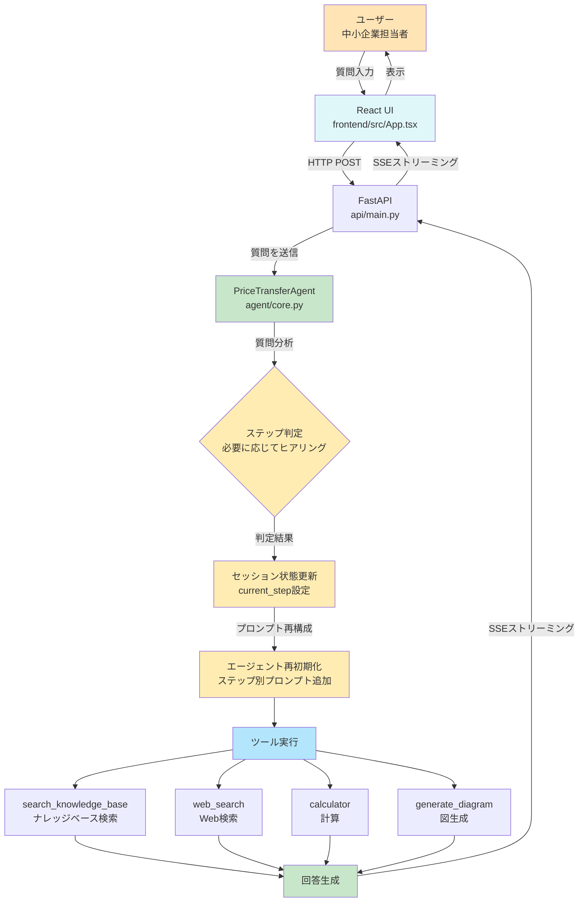
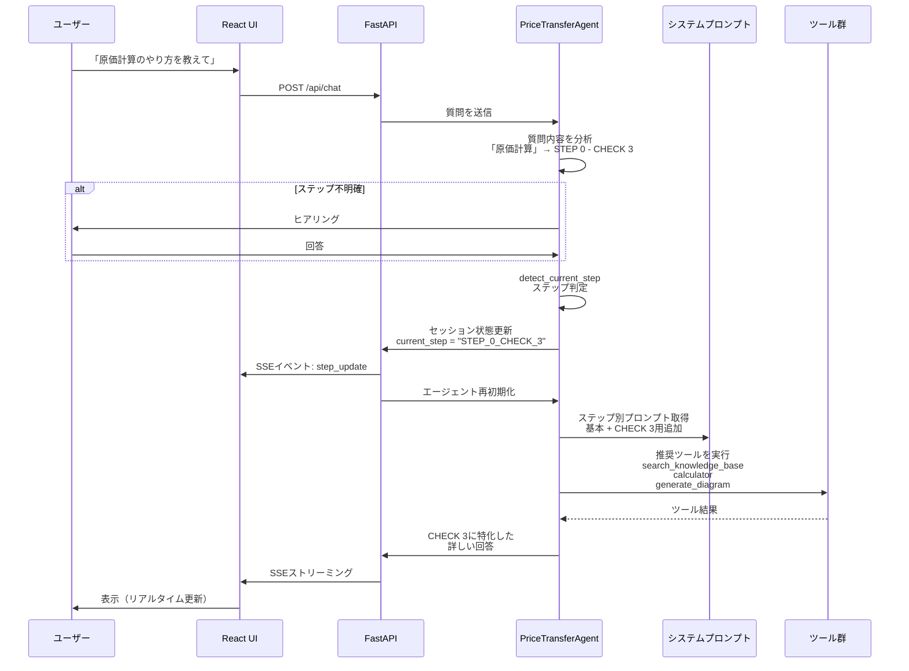
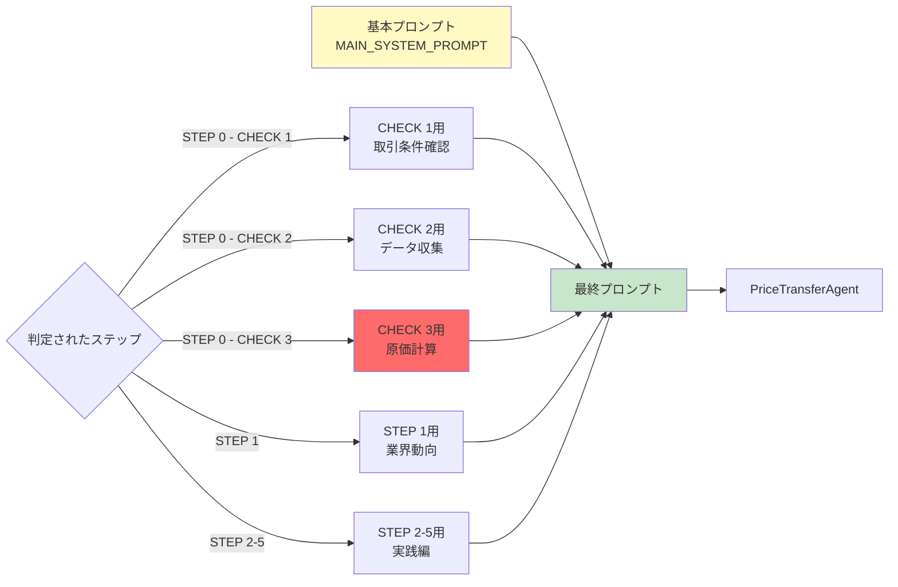
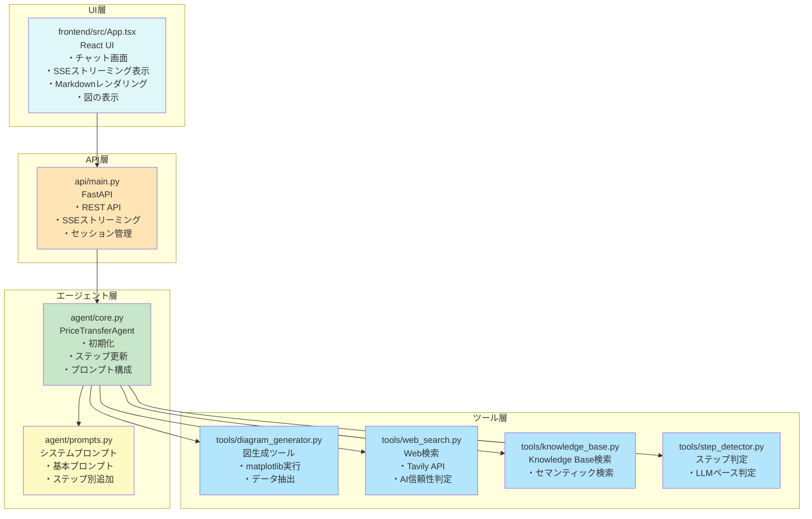
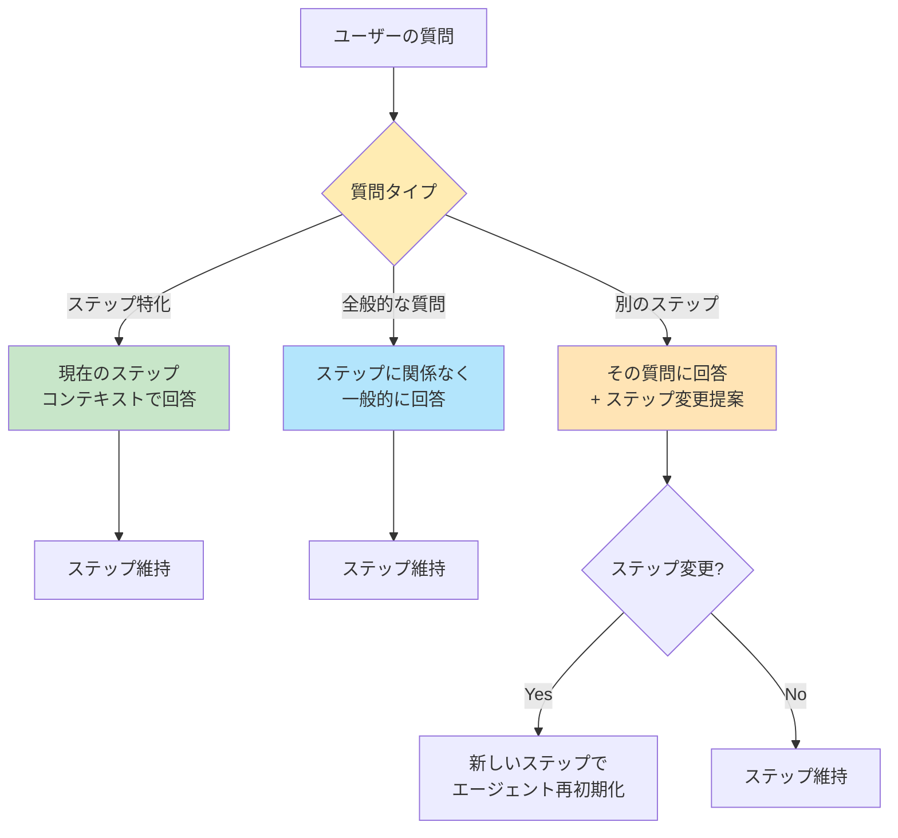
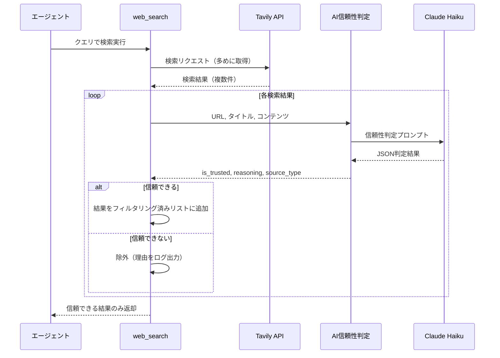

# システムアーキテクチャ図

## 全体フロー



## ステップ判定と動的プロンプト切り替え



## プロンプト構成



## データフロー

```mermaid
graph TD
    Session[FastAPI Sessions<br/>api/main.py] -->|保持| SID[session_id]
    Session -->|保持| MSG[messages<br/>会話履歴]
    Session -->|保持| AGT[agent<br/>エージェントインスタンス]
    Session -->|保持| STEP[current_step<br/>判定されたステップ]
    
    React[React State] -->|取得| API[GET /api/session/{id}/messages]
    React -->|更新| API2[POST /api/chat]

    STEP -->|例| E1["STEP_0_CHECK_3"]
    STEP -->|例| E2["STEP_1"]
    STEP -->|例| E3["None (未判定)"]

    STEP --> Update{ステップ更新?}
    Update -->|Yes| Reinit[エージェント再初期化<br/>新しいプロンプトで]
    Update -->|No| Keep[現状維持]

    style Session fill:#FFFDE7
    style STEP fill:#FFECB3
    style E1 fill:#FF6B6B
```

## ファイル構成と責務



## ステップ判定の柔軟性



---

## 重要なポイント

### 1. ステップ判定は「推奨」であって「制約」ではない
- ステップが判定されても、全般的な質問や他のステップの質問にも柔軟に対応
- ステップは「フォーカス」を設定するだけ

### 2. プロンプトの動的切り替え
- 基本プロンプト + ステップ別追加プロンプトで構成
- ステップ判定後、エージェントを再初期化して最適化

### 3. ツールの推奨使用
- 各ステップに応じて推奨ツールを自動的に使用
- 例: CHECK 3 では `search_knowledge_base` + `calculator` + `generate_diagram`

### 4. セッション状態の活用
- `current_step` でステップを管理（バックエンドで管理）
- 会話中にステップが変わっても対応可能
- フロントエンドでステップ表示を更新

### 5. アーキテクチャの分離
- **フロントエンド**: React + TypeScript（UI層）
- **バックエンド**: FastAPI（API層、セッション管理）
- **エージェント**: Strands Agents（ビジネスロジック層）
- **ツール**: 各種ツール実装（機能層）

### 6. ストリーミング実装
- Server-Sent Events (SSE) を使用
- リアルタイムでテキストチャンクを送信
- ツール使用中やステップ更新もイベントとして送信

---

## ツール詳細

### `web_search` (tools/web_search.py)
**目的**: Web検索を実行し、AI判定により信頼できる情報源のみを表示

**機能**:
- Tavily APIを使用したWeb検索
- **AI信頼性判定機能**: Claude Haikuが各検索結果のURL、タイトル、コンテンツを評価
- 信頼できる公的機関（政府機関、自治体、支援機関など）のソースのみフィルタリング
- ソース種別を自動分類（政府機関/公的機関/学術機関/メディア）
- 最大5件の検索結果を取得

**AI信頼性判定の仕組み**:
1. Tavily APIで検索結果を取得（多めに取得）
2. 各結果に対して`is_trusted_source_ai()`を実行
3. Claude Haikuが以下を判定:
   - 信頼性の可否（is_trusted）
   - 判定理由（reasoning）
   - ソース種別（source_type）
4. 信頼できると判定された結果のみを返却

**判定基準**:
- ✅ 信頼できる: 政府機関(.go.jp)、地方自治体(.lg.jp)、公的支援機関、大学・研究機関(.ac.jp)、信頼できる業界団体
- ❌ 信頼できない: 個人ブログ、アフィリエイトサイト、まとめサイト、広告目的サイト

### `search_knowledge_base` (tools/knowledge_base.py)
**目的**: AWS Bedrock Knowledge Baseから価格転嫁関連情報を検索

**機能**:
- ナレッジベースID: `7SM8UQNQFL` (ap-northeast-1)
- セマンティック検索（ベクトル検索）
- 最大5件の結果を取得
- 出典ファイル名とスコアを表示
- S3ロケーションから元ファイルを特定

**使用場面**:
- Knowledge Baseを最優先で使用
- 公式ガイドラインや価格転嫁事例を検索
- 具体的な手順やチェックリストの取得

### `detect_current_step` (tools/step_detector.py)
**目的**: ユーザーの質問から価格転嫁プロセスのステップを自動判定

**機能**:
- Claude Haikuを使用したLLMベース判定
- STEP 0 (CHECK 1〜8) および STEP 1〜5 に対応
- 判定理由と信頼度（high/medium/low）を返却
- 詳細なデバッグログ機能

**判定フロー**:
1. ユーザーの質問内容を分析
2. 価格転嫁プロセスの各ステップ定義と照合
3. 最も関連性の高いステップを判定
4. JSON形式で結果を返却: `{"step": "STEP_0_CHECK_3", "confidence": "high", "reasoning": "..."}`

### `generate_diagram` (tools/diagram_generator.py)
**目的**: データを可視化する図を自動生成

**機能**:
- 4種類の図に対応: 棒グラフ、折れ線グラフ、フローチャート、ネットワーク図
- description からデータを自動抽出（JSON形式、テーブル形式、リスト形式）
- 生成された図は `diagrams/` フォルダに保存
- UI上で最新の図を自動表示
- 日本語フォント対応（Windows/macOS/Linux）

**使用場面**:
- 原価構造の可視化（STEP 0 - CHECK 3）
- 価格推移のグラフ化
- プロセスフローの図示

---

## データフロー: Web検索（AI信頼性判定付き）



---

## React版への移行

### アーキテクチャの変更点

**旧構成（Streamlit版）:**
- UIとバックエンドが統合（`app.py`）
- Streamlitのセッション管理
- Streamlit独自のストリーミング

**新構成（React版）:**
- **フロントエンド**: React + TypeScript（`frontend/`）
- **バックエンド**: FastAPI（`api/main.py`）
- **分離**: UI層とAPI層を明確に分離
- **ストリーミング**: Server-Sent Events (SSE)
- **セッション管理**: FastAPIのメモリ管理

### 通信フロー

```
React UI (ポート5173)
    ↓ HTTP POST
FastAPI (ポート8000)
    ↓ エージェント呼び出し
PriceTransferAgent
    ↓ ツール実行
各種ツール
    ↓ 結果返却
FastAPI
    ↓ SSEストリーミング
React UI (リアルタイム更新)
```

### セッション管理の違い

**Streamlit版:**
```python
st.session_state = {
    "session_id": str,
    "messages": list,
    "agent": PriceTransferAgent,
    "current_step": str | None
}
```

**React版:**
- バックエンド: FastAPIのメモリ上で管理
- フロントエンド: React Stateで表示用データを保持
- API経由で同期

### 起動方法

詳細は `README_REACT.md` を参照。

**簡単な起動:**
```bash
start_all.bat  # Windows
```

**個別起動:**
```bash
# ターミナル1
python api/main.py

# ターミナル2
cd frontend
npm run dev
```
